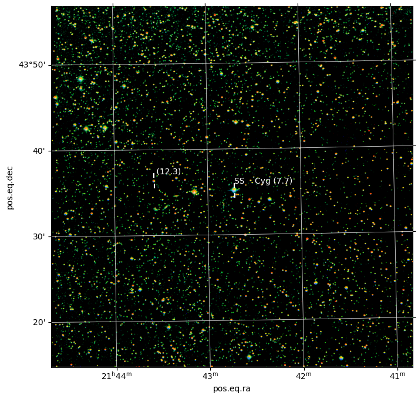

# OUScope

<!-- WARNING: THIS FILE WAS AUTOGENERATED! DO NOT EDIT! -->

The library provides access and control for the telescope. The functions
help with job submission, image retrival and initial analysis. For naw
this is aimed at variable star observations, but there is nothing
prohibiting additional modules intended for different fields
(e.g. astrometry).

## Install

The package is not yet published to pypi/conda, thus for now the only
way to install it is the developer-style install. I recommend the
following sequence:

``` bash
git clone https://github.com/jochym/ouscope.git
cd ouscope
python3 -m venv venv 
. venv/bin/activate

pip install -e .
```

Later on you just go to the ouscope directory and run:

``` bash
. venv/bin/activate
```

to activate the virtual environment.

### Update

With developer install the upgrade is simple, `git pull` should do the
trick :

``` bash
cd ouscope
git pull
```

When the set of dependecies changes you may need to

``` bash
pip uninstall ouscope ; pip install -e .
```

to refresh your setup.

## How to use

The library is not ready but you can try to use it for some tasks.
Before this example will run you need to have some additional setup:

- Local AstrometryNet solver (`solve-field` command) installed and
  configured. It is possible to use nova.astrometry.net solver but the
  automatic interaction/switching is not complete yet. You can modify
  the example to use it (see
  [`Solver`](https://jochym.github.io/ouscope/solver.html#solver) docs
  for some guidance)
- The config file for your telescope.org account. The cache directories
  will be created in the current working directory with this setup. You
  may move them to some other place (e.g. `~/.cache/ouscope`):

<!-- -->

    [cache]
    wcs=.cache/wcs
    jobs=.cache/jobs
    seq=.cache/seq

    [telescope.org]
    user=jour_user_name
    password=your_password

    [astrometry.net]
    apikey=your_astrometry.net_api_key

If it still does not work, please submit a github issue. I do not have
many systems to test the library on. Below is a simple example.

### Interacting with telescope.org

The code below: - creates the
[`Telescope`](https://jochym.github.io/ouscope/core.html#telescope)
object `scope` - automatically logs-in to the user from the config
file - lists user folders - gets user requests sorted by request ID
(i.e. submission order) - goes over the list until five completed
requests are listed - downloads the latest completed job into `obs`
variable - prints JobID:RequestID, target name,

<details>
<summary>Code</summary>

``` python
from ouscope.core import Telescope

scope=Telescope(config='~/.config/telescope.ini')

print("User folders:")
for f in scope.get_user_folders():
    cnt = f["count"] 
    if cnt is None:
        cnt = 0
    print(f'{f["name"]:>12} ({f["id"]:>3}): {cnt:>4} items')

reqlst=scope.get_user_requests(sort='rid')

print(f'\nUser {scope.user} has {len(reqlst)} requests.')
print("\nThe most recent requests:")
last_complete = None
complete = []
n = 5
for rq in reqlst:
    jid = scope.get_jid_for_req(rq)
    print(f'{rq["id"]}: {rq["objectname"]:15} jid: {(jid if jid else ""):6}', end=' ')
    print(f'{Telescope.REQUESTSTATUS_TEXTS[int(rq["status"])]}')
    if rq["status"]=='8':
        complete.append(jid)
        if last_complete is None:
            last_complete = jid
        n -= 1
    if n<0 :
        break
print()

jid = complete[0]
# Let us show the newest job
job = scope.get_job(int(jid))
req = scope.get_request(int(job['rid']))
target = req['name'].lstrip().rstrip()

print('The latest complete job:')
print(f'J{jid}:R{job["rid"]} ({target}) Completed at: {" ".join(job["completion"])}')

obs = scope.get_obs(job, verbose=True)

scope.logout()
```

</details>

    User folders:
           Inbox (  1): 1720 items
      Favourites (  2):    0 items
         Archive (  3):  447 items
           Trash (  4):   63 items
        Complete (461):   13 items

    User jochym has 1720 requests.

    The most recent requests:
    760531: EQ Lyr          jid:        New
    760530: LX Cyg          jid:        New
    760529: DQ Vul          jid:        New
    760528: DX Vul          jid:        New
    760527: V686 Cyg        jid:        New
    760526: SS Cyg          jid:        New
    760525: CH Cyg          jid:        New
    760205: DQ Vul          jid: 413202 Complete
    760204: DX Vul          jid: 413201 Complete
    760203: V686 Cyg        jid: 413200 Complete
    760202: IP Cyg          jid:        Waiting
    760124: LX Cyg          jid: 413122 Complete
    760123: EQ Lyr          jid: 413121 Complete
    760122: SS Cyg          jid: 413120 Complete

    The latest complete job:
    J413202:R760205 (DQ Vul) Completed at: 14 December 2023 20:10:35 UTC
    OK_WAIT                       
    READY                         

### Analysis of the data

Let us plot and analyse the last completed job listed above.

The code below: - opens the data downloaded above (`obs` variable) -
plate-solves the resultings fits data (with local AstrometryNet
solver) - creates WCS object from the solution - plots the RGB image of
the data with RA-DEC grid - query the Vizier database for variable stars
0.25 deg from center - mark all objects found on the picture

<details>
<summary>Code</summary>

``` python
from astropy.io import fits
from astropy.wcs import WCS
from astropy.coordinates import SkyCoord
import astropy.units as u
from astroquery.vizier import Vizier
import matplotlib.pyplot as plt
from ouscope.solver import Solver
from ouscope.process import make_color_image
```

</details>
<details>
<summary>Code</summary>

``` python
solver = Solver()

hdu = fits.open(obs)[0]

wcs_head = solver.solve(hdu, tout=30)
wcs = WCS(wcs_head, naxis=2)
wcs.printwcs()
```

</details>

    Solving for 5644BC43
    solve-field -p -l 30 -O -L 1 -H 2 -u app -3 300.012500 -4 22.780833 -5 2 /tmp/field-solverb4lz3sjc/tmpvpoposve.fits
    WCS Keywords

    Number of WCS axes: 2
    CTYPE : 'RA---TAN-SIP' 'DEC--TAN-SIP' 
    CRVAL : 299.968935258 22.8122733346 
    CRPIX : 845.046401978 811.336247683 
    CD1_1 CD1_2  : -0.000466593770382 -6.05975347053e-06 
    CD2_1 CD2_2  : -7.17872510289e-06 0.000465931891585 
    NAXIS : 1536  1536  3

    WARNING: FITSFixedWarning: EPOCH = 'REAL' 
    a floating-point value was expected. [astropy.wcs.wcs]
    WARNING: FITSFixedWarning: RADECSYS= 'ICRS' 
    the RADECSYS keyword is deprecated, use RADESYSa. [astropy.wcs.wcs]

<details>
<summary>Code</summary>

``` python
fig = plt.figure(figsize=(8,8))
ax = plt.subplot(projection=wcs)
plt.grid(color='white', ls='solid', lw=0.5)

# crop the data to remove overscan noise
l, r, t, b = (0, 32, 0, 32)
plt.imshow(make_color_image(hdu.data[:, l:-r, t:-b],
                            order=hdu.header["FILTER"].split(",")))

center = wcs.pixel_to_world(wcs_head['NAXIS1']/2,wcs_head['NAXIS2']/2)
objects = Vizier.query_region(catalog='B/gcvs', 
                             coordinates=center, 
                             radius='0.25deg')
for g in objects:
    for n, o in enumerate(g):
        name = o['VarName']
        radec = SkyCoord(o['RAJ2000'] + o['DEJ2000'], 
                         frame='icrs', unit=(u.hourangle, u.deg))
        ax.scatter([radec.ra.deg, radec.ra.deg], 
                   [radec.dec.deg-0.01, radec.dec.deg+0.01], 
                   marker='|', s=30,
                   color='white',
                   transform=ax.get_transform('world'))
        ax.text(radec.ra.deg, radec.dec.deg+0.014, 
                f'{name} ({o["magMax"]:.1f})', 
                transform=ax.get_transform('world'), color='white')
```

</details>



### List of objects (variable stars) in the frame

<div><i>Table length=8</i>
<table id="table139994011712336" class="table-striped table-bordered table-condensed">
<thead><tr><th>GCVS</th><th>n_GCVS</th><th>RAJ2000</th><th>DEJ2000</th><th>VarType</th><th>magMax</th><th>Period</th><th>SpType</th><th>Exists</th><th>VarName</th><th>Simbad</th></tr></thead>
<thead><tr><th></th><th></th><th></th><th></th><th></th><th>mag</th><th>d</th><th></th><th></th><th></th><th></th></tr></thead>
<thead><tr><th>str10</th><th>str1</th><th>str11</th><th>str11</th><th>str10</th><th>float32</th><th>float64</th><th>str17</th><th>str12</th><th>str11</th><th>str6</th></tr></thead>
<tr><td>SW Vul</td><td>x</td><td>20 00 05.21</td><td>+22 56 06.6</td><td>UGSS</td><td>14.500</td><td>15.0000000000</td><td></td><td></td><td>SW    Vul</td><td>Simbad</td></tr>
<tr><td>DQ Vul</td><td>x</td><td>20 00 03.01</td><td>+22 46 51.7</td><td>M</td><td>14.500</td><td>310.0000000000</td><td></td><td></td><td>DQ    Vul</td><td>Simbad</td></tr>
<tr><td>V0418 Vul</td><td></td><td>19 59 41.89</td><td>+22 33 49.6</td><td>M:</td><td>13.600</td><td>--</td><td></td><td></td><td>V0418 Vul</td><td>Simbad</td></tr>
<tr><td>V0433 Vul</td><td>x</td><td>20 00 32.54</td><td>+22 40 15.4</td><td>SR:</td><td>10.300</td><td>--</td><td></td><td></td><td>V0433 Vul</td><td>Simbad</td></tr>
<tr><td>V0434 Vul</td><td>x</td><td>20 00 33.23</td><td>+22 43 41.2</td><td>SR:</td><td>11.400</td><td>--</td><td></td><td></td><td>V0434 Vul</td><td>Simbad</td></tr>
<tr><td>V0452 Vul</td><td>x</td><td>20 00 43.71</td><td>+22 42 39.0</td><td>BY</td><td>7.670</td><td>12.0390000000</td><td>G5V</td><td></td><td>V0452 Vul</td><td>Simbad</td></tr>
<tr><td>V0498 Vul</td><td>*</td><td>19 59 51.29</td><td>+22 42 32.3</td><td>UGSU</td><td>15.600</td><td>--</td><td></td><td></td><td>V0498 Vul</td><td>Simbad</td></tr>
<tr><td>V0571 Vul</td><td>*</td><td>19 59 29.73</td><td>+22 45 13.1</td><td>M</td><td>14.400</td><td>214.0000000000</td><td></td><td></td><td>V0571 Vul</td><td>Simbad</td></tr>
</table></div>
